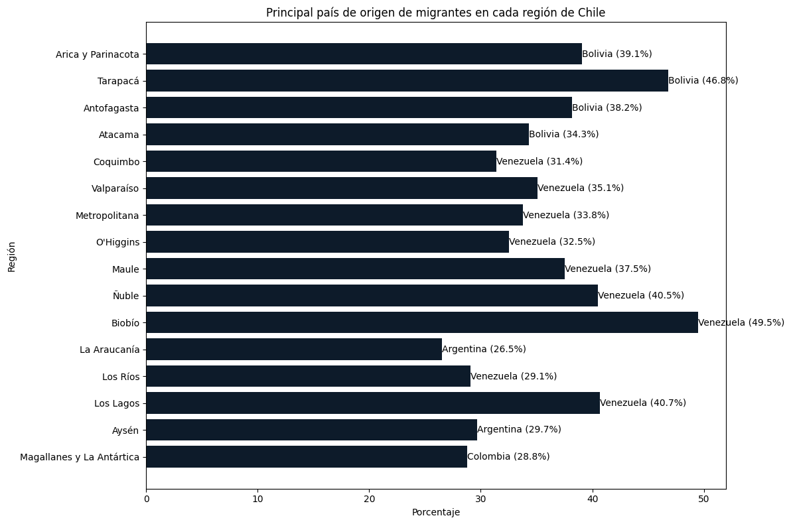

# Crónica

# **Migración en Chile: Predominancia Venezolana y Boliviana en Diferentes Regiones del País**

 

En el norte de Chile, las primeras cuatro regiones - Arica y Parinacota, Tarapacá, Antofagasta y Atacama - muestran una notable tendencia migratoria, con Bolivia como el principal país de origen de los migrantes. Este patrón destaca la fuerte conexión histórica y geográfica entre Chile y Bolivia, donde los migrantes bolivianos representan la mayoría en estas zonas ricas en oportunidades laborales y económicas.

El centro del país presenta una realidad diferente. Regiones como Coquimbo, Valparaíso y la Metropolitana están marcadas por una alta concentración de migrantes venezolanos. La búsqueda de mejores condiciones de vida y oportunidades económicas ha llevado a una significativa diáspora venezolana a estas zonas urbanas, donde la oferta de empleo y servicios es más amplia. Este flujo migratorio ha transformado el paisaje social y económico del centro de Chile.

Llama especialmente la atención la Región del Biobío, donde un sorprendente 49,5% de la población migrante proviene de Venezuela, convirtiéndola en la región con mayor concentración de migrantes venezolanos en el país. En el análisis general de las 16 regiones de Chile, se observa que en 9 de ellas los migrantes venezolanos son la mayoría. Este fenómeno refleja no solo la magnitud de la migración venezolana, sino también los desafíos que enfrenta Chile en términos de integración y políticas públicas para atender las necesidades de estas diversas comunidades migrantes.